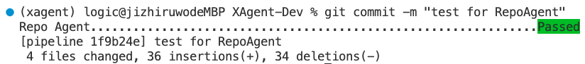
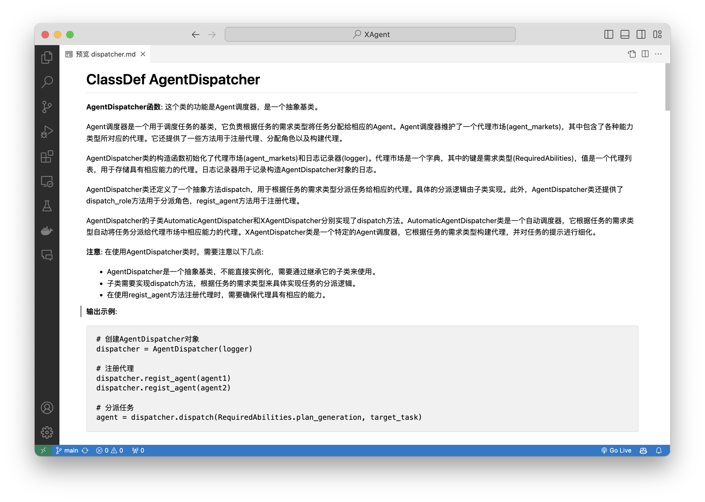
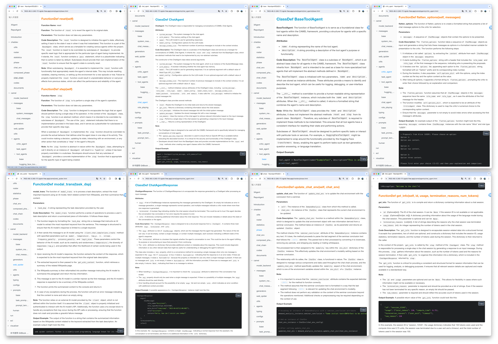

[英文](README.md) | [背景](#-背景) ｜ [特性](#-特性) ｜ [快速开始](#-快速开始) | [未来工作](#-未来工作) | [支持语言](#-支持语言) | [引用我们](#-引用我们)

# 🤗 介绍

RepoAgent是一个由大型语言模型（LLMs）驱动的开源项目，旨在提供智能化的项目文档编写方式。
它的设计目标是成为开发人员的便捷工具，用于创建、维护清晰易懂的代码文档并在团队成员之间应用协作。

**论文地址**：http://arxiv.org/abs/2402.16667


# 👾 背景
在计算机编程领域，全面的项目文档非常重要，包括对每个Python文件的详细解释。这样的文档是理解、维护和增强代码库的基石。它为代码提供了必要的上下文解读，使当前和未来的开发人员更容易理解软件的目的、功能和结构。它不仅有助于当前和未来的开发人员理解项目的目的和结构，还确保项目随着时间的推移保持可访问和可修改，极大地降低了新团队成员的学习曲线。

传统上，创建和维护软件文档需要大量的人力和专业知识，这对于没有专门人员的小团队来说是一个挑战。大型语言模型（LLMs）如GPT的引入改变了这一情况，使得AI能够处理大部分文档编写过程。这种转变使得人类开发人员可以专注于验证和微调修改，极大地减轻了文档编写的人工负担。

**🏆 我们的目标是创建一个智能的文档助手，自动生成和维护文档，并帮助人类阅读并理解repo项目，最终帮助人类提高效率、节省时间。**

# 🪭 特性

- **🤖 自动检测Git仓库中的变更，跟踪文件的添加、删除和修改。**
- **📝 通过深度递归+AST独立分析代码结构，为各个对象生成文档。**
- **🔍 精准识别对象间双向调用关系，丰富文档内容的全局视野**
- **📚 根据变更无缝替换Markdown内容，保持文档的一致性。**
- **🕙 执行多线程并发操作，提高文档生成的效率。**
- **👭 为团队协作提供可持续、自动化的文档更新方法。**
- **😍 美观的文档书（Gitbook）展示**

# 📦 安装
首先，确保您的机器安装了python3.9以上的版本
```
$ python --version
python 3.11.4
```

接着，克隆本项目，创建一个虚拟环境，并在环境内安装依赖
```
cd RepoAgent
conda create -n RepoAgent python=3.11.4
conda activate RepoAgent
pip install -r requirements.txt
```

# 📖 快速开始
## 配置RepoAgent
在`config.yml`文件中，配置OpenAI API的相关参数信息、如目标仓库的路径、文档语言等。
```yaml
api_keys:
  gpt-3.5-turbo-16k:
    - api_key: sk-XXXX
      base_url: https://example.com/v1/
      api_type: azure
      api_version: XXX
      engine: GPT-35-Turbo-16k
      # you can use any kwargs supported by openai.ChatCompletion here
    - api_key: sk-xxxxx
      organization: org-xxxxxx
      model: gpt-3.5-turbo-16k
  ...

default_completion_kwargs:
  model: gpt-4
  temperature: 0.2
  request_timeout: 60

repo_path: /path/to/your/repo
project_hierarchy: .project_hierarchy # 全局结构信息文件夹的路径
Markdown_Docs_folder: Markdown_Docs # 目标存储库根目录中用于存储文档的文件夹
ignore_list: ["ignore_file1.py", "ignore_file2.py", "ignore_directory"] # 通过在ignore_list中给出相对路径来忽略一些您不想为其生成文档的py文件或文件夹

language: zh # 双字母语言代码（ISO 639-1 代码），例如 `language: en` 表示英语，有关更多语言，请参阅支持的语言
max_thread_count: 10 # 我们支持多线程执行来加速文档生成过程
max_document_tokens: 1024 # 每一个对象文档（如类、函数）允许的最大长度
log_level: info # log信息显示等级
```

## 运行RepoAgent
进入RepoAgent根目录，在命令行输入以下命令：

```sh
python -m repo_agent # 此命令将生成文档或更新文档（pre-commit钩子将自动调用此命令）

# 你也可以尝试以下功能
python -m repo_agent clean # 此命令将删除与repoagent相关的缓存
python -m repo_agent print # 此命令将打印repo-agent如何解析目标仓库
python -m repo_agent diff # 此命令将检查基于当前代码更改将更新/生成哪些文档
```

如果您是第一次对目标仓库生成文档，此时RepoAgent会自动生成一个维护全局结构信息的json文件，并在目标仓库根目录下创建一个名为Markdown_Docs的文件夹，用于存放文档。
全局结构信息json文件和文档文件夹的路径都可以在`config.yml`中进行配置。

当您首次完成对目标仓库生成全局文档后，或您clone下来的项目已经包含了全局文档信息后，就可以通过**pre-commit**配置目标仓库**hook**和团队一起无缝自动维护一个项目内部文档了！

## 配置目标仓库

RepoAgent目前支持对项目的文档生成和自动维护，因此需要对目标仓库进行一定的配置。

首先，确保目标仓库是一个git仓库，且已经初始化。
```
git init
```
在目标仓库中安装pre-commit，用于检测git仓库中的变更。
```
pip install pre-commit
```
在目标仓库根目录下，创建一个名为`.pre-commit-config.yaml`的文件，示例如下：
```
repos:
  - repo: local
    hooks:
    - id: repo-agent
      name: RepoAgent
      entry: python path/to/your/repo_agent/runner.py
      language: system
      # 可以指定钩子触发的文件类型，但是目前只支持python
      types: [python]
```
具体hooks的配置方法请参考[pre-commit](https://pre-commit.com/#plugins)。
配置好yaml文件后，执行以下命令，安装钩子。
```
pre-commit install
```
这样，每次git commit时，都会触发RepoAgent的钩子，自动检测目标仓库中的变更，并生成对应的文档。
接着，可以对目标仓库进行一些修改，例如在目标仓库中添加一个新的文件，或者修改一个已有的文件。
您只需要正常执行git的工作流程: git add, git commit -m "your commit message", git push
RepoAgent hook会在git commit时自动触发，检测前一步您git add的文件，并生成对应的文档。

执行后，RepoAgent会自动更改目标仓库中的已暂存文件并正式提交commit，执行完毕后会显示绿色的Passed，如下图所示：


生成的文档将存放在目标仓库根目录下的指定文件夹中，生成的文档效果如下图所示：




我们使用默认模型**gpt-3.5-turbo**对一个约**27万行**的中大型项目[**XAgent**](https://github.com/OpenBMB/XAgent)生成了文档。您可以前往XAgent项目的Markdown_Docs文件目录下查看生成效果。如果您希望得到更好的文档效果，我们建议您使用更先进的模型，如**gpt-4-1106** 或 **gpt-4-0125-preview**。

**最后，您可以通过自定义Prompt来灵活调整文档的输出格式、模板等方面的效果。 我们很高兴您探索更科学的自动化Technical Writing Prompts并对社区作出贡献。**

### 探索 chat with repo

我们将与仓库对话视为所有下游应用的统一入口，作为连接RepoAgent与人类用户和其他AI智能体之间的接口。我们未来的研究将探索适配各种下游应用的接口，并实现这些下游任务的独特性和现实要求。

在这里，我们展示了我们的下游任务之一的初步原型：自动issue问题解答和代码解释。您可以通过在终端运行以下代码启动服务。
```bash
python -m repo_agent.chat_with_repo
```

# ✅ 未来工作

- [x] 对象间父子关系层级结构识别及维护
- [x] 实现 Black commit
- [x] **Bi-direct reference** 构建双向引用拓扑结构
- [x] **与仓库对话(chat with repo)** 通过直接提供相关代码文件、代码块和文档信息使用户能直接向Repo提问
- [ ] 通过全局文档信息自动生成仓库README.md文件
- [ ] **多编程语言支持** 支持更多编程语言，如Java、C或C++等
- [ ] 本地模型支持如 Llama、chatGLM、Qianwen 等
- [ ] 支持通过`pip install repoagent`将项目作为包进行安装配置
- [x] 自动生成Gitbook等更佳的可视化效果

# 🥰 精选案例

以下是采用了RepoAgent的开源项目精选案例。

- [MiniCPM](https://github.com/agencyenterprise/react-native-health): 一个端侧大语言模型，大小为2B，效果可与7B模型媲美。
- [ChatDev](https://github.com/revtel/react-native-nfc-manager): 用于软件开发的协作式AI智能体。
- [Xagent](https://github.com/OpenBMB/XAgent): 一个用于解决复杂任务的自主大型语言模型智能体。

# 🇺🇳 支持语言
在`config.yml`配置文件中使用两个字母的语言代码（ISO 639-1代码）设置生成文档的目标语言，点击下方的'语言列表'部分以展开支持的语言列表。

<details>
<summary>语言列表</summary>

| 国旗 | 语言代码 | 语言   |
|------|------|------------|
| 🇬🇧 | en   | English    |
| 🇪🇸 | es   | Spanish    |
| 🇫🇷 | fr   | French     |
| 🇩🇪 | de   | German     |
| 🇨🇳 | zh   | Chinese    |
| 🇯🇵 | ja   | Japanese   |
| 🇷🇺 | ru   | Russian    |
| 🇮🇹 | it   | Italian    |
| 🇰🇷 | ko   | Korean     |
| 🇳🇱 | nl   | Dutch      |
| 🇵🇹 | pt   | Portuguese |
| 🇸🇦 | ar   | Arabic     |
| 🇹🇷 | tr   | Turkish    |
| 🇸🇪 | sv   | Swedish    |
| 🇩🇰 | da   | Danish     |
| 🇫🇮 | fi   | Finnish    |
| 🇳🇴 | no   | Norwegian  |
| 🇵🇱 | pl   | Polish     |
| 🇨🇿 | cs   | Czech      |
| 🇭🇺 | hu   | Hungarian  |
| 🇬🇷 | el   | Greek      |
| 🇮🇱 | he   | Hebrew     |
| 🇹🇭 | th   | Thai       |
| 🇮🇳 | hi   | Hindi      |
| 🇧🇩 | bn   | Bengali    |

</details>

> 例如，`language: en`代表生成的文档使用英语。

# 📊 引用我们
```bibtex
@misc{luo2024repoagent,
      title={RepoAgent: An LLM-Powered Open-Source Framework for Repository-level Code Documentation Generation}, 
      author={Qinyu Luo and Yining Ye and Shihao Liang and Zhong Zhang and Yujia Qin and Yaxi Lu and Yesai Wu and Xin Cong and Yankai Lin and Yingli Zhang and Xiaoyin Che and Zhiyuan Liu and Maosong Sun},
      year={2024},
      eprint={2402.16667},
      archivePrefix={arXiv},
      primaryClass={cs.CL}
}
```

