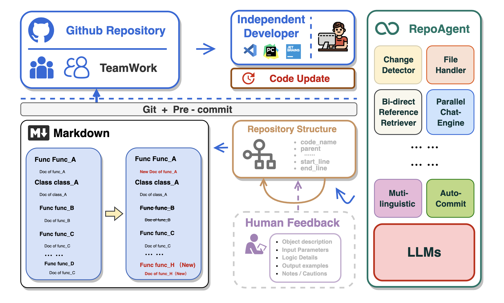

# RepoAgent:  Intelligent tool for documenting codebase.

<p align="center">
  
  <a href="https://pypi.org/project/repoagent/">
    
  </a>
  <a href="Pypi">
    
  </a>
</p>

<p align="center">
  
</p>

<p align="center">
  <a href="https://github.com/LOGIC-10/RepoAgent/blob/main/README.md">English readme</a>
   • 
  <a href="https://github.com/LOGIC-10/RepoAgent/blob/main/README_CN.md">简体中文 readme</a>
</p>

RepoAgent is driven by Large Language Models(LLMs) that aims to provide an intelligent way to document projects. It is designed to be a handy tool for developers who need to organize their code and cooperate with teammates.

**🏆 Our goal is to create an intelligent document assistant that helps people read and understand repositories and generate documents, ultimately helping people improve efficiency and save time.**

## 👾 Background

In the realm of computer programming, the significance of comprehensive project documentation, including detailed explanations for each Python file, cannot be overstated. Such documentation serves as the cornerstone for understanding, maintaining, and enhancing the codebase. It provides essential context and rationale for the code, making it easier for current and future developers to comprehend the purpose, functionality, and structure of the software. It not only facilitates current and future developers in grasping the project's purpose and structure but also ensures that the project remains accessible and modifiable over time, significantly easing the learning curve for new team members.

Traditionally, creating and maintaining software documentation demanded significant human effort and expertise, a challenge for small teams without dedicated personnel. The introduction of Large Language Models (LLMs) like GPT has transformed this, enabling AI to handle much of the documentation process. This shift allows human developers to focus on verification and fine-tuning, greatly reducing the manual burden of documentation.

## ✨ Features

- 🤖 Detects changes in Git repos: track file additions, deletions, and modifications.
- 📝 Analyzes code structure via AST for document generation.
- 🔍 Identifies inter-object invocation relationships for comprehensive documentation.
- 📚 Seamlessly updates Markdown content to keep documentation consistent.
- 🕙 Enhances document generation efficiency with multi-threaded operations.
- 👭 Provides automated documentation updates for collaborative teamwork.

## Configuration

### Step 1: Installation

First, ensure you have the required Python version (e.g., Python 3.10 or higher):
```sh
python --version
```

Then, install RepoAgent using pip:

```sh
pip install repoagent
```

### Step 2: Set OpenAI API Key

Set your OpenAI API key as an environment variable:

```sh
export REPOAGENT_OPENAI_API_KEY=YOUR_API_KEY_HERE
```

Replace `YOUR_API_KEY_HERE` with your actual OpenAI API key.

### Step 3: Configuration

Configure RepoAgent by specifying the target folder:

```sh
repoagent configure
```

Follow the prompts to set the target directory and other configuration options.

### Step 4: Run RepoAgent

Finally, run RepoAgent to start generating documentation:

```sh
repoagent run
```

## 🚀 Project Roadmap

- [x] Identification and maintenance of parent-child relationship hierarchy structure between objects
- [ ] **Bi-direct reference**  Construct Bi-directional reference topology
- [ ] **chat with repo** Chat with the repository by giving code and document at the same time 
- [ ] Generate README.md automatically combining with the global documentation
- [ ] **Multiple programming language support** Support more languages like Java, C or C++, etc.
- [ ] Local model support like Llama, chatGLM, Qianwen, etc.
- [ ] Automatically generate better visualizations such as Gitbook

## License

This project is licensed under the terms of the Apache-2.0 license.